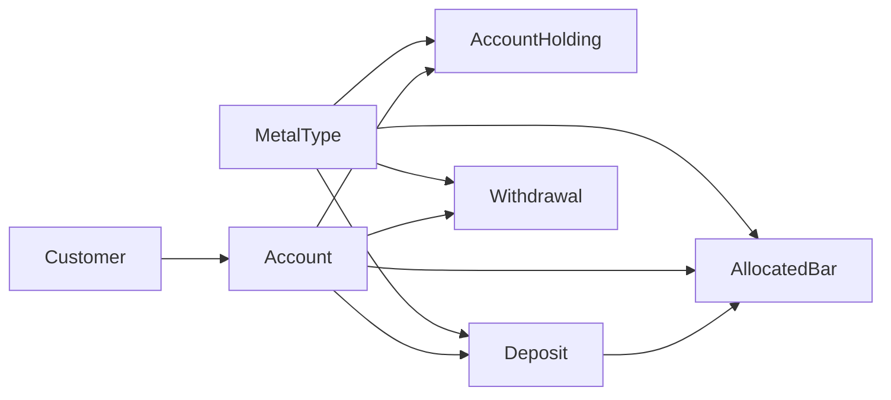

# Bare Metals

A small **precious-metals custody** web app built for Digital Asset Custody. Customers hold **accounts** with **balances** in one or more **metal types** (gold, silver, and so on), split by **storage** model: **allocated** (specific bars) vs **unallocated** (pooled). You can record **deposits** and **withdrawals**, inspect **holdings** and **allocated bars**, and use a **dashboard** with portfolio-style KPIs and charts.

---

## Features

- **Dashboard** — Total portfolio value (from holdings × current metal prices), gold holdings mass, account count, asset breakdown, recent deposit/withdrawal activity, Chart.js views for storage split and per-metal composition.
- **Customers** — List, create, and view customer profiles.
- **Accounts** — List and detail views per account (linked to a customer).
- **Metal types** — Configure metals, list/create/update/delete, and maintain **price per kg** for valuation.
- **Custody actions** — Record deposits and withdrawals (modals + POST endpoints); flows tie into holdings and, where relevant, allocated inventory.
- **Transactions** — Index of transactional activity for review.
- **UI** — Blade layouts, Heroicons, flash toasts, and focused vanilla JS (no Alpine).

---

## Tech stack

| Layer | Choices |
|--------|---------|
| Backend | PHP **^8.3**, **Laravel ^13** |
| HTTP / views | Blade, controllers under `app/Http/Controllers` |
| Frontend assets | **Vite ^8**, **Tailwind CSS ^4**, **Chart.js** |
| Database | **PostgreSQL** (default name `bare_metals` in `.env.example`) |
| Session, cache, queue | **database** drivers (per `.env.example`) |
| Tests | **Pest** (`composer test` → `php artisan test`) |

---

## Prerequisites

- PHP **8.3+** with extensions Laravel expects (including **`pdo_pgsql`** for PostgreSQL)
- [Composer](https://getcomposer.org/)
- [Node.js](https://nodejs.org/) (current LTS is fine) and npm
- A running **PostgreSQL** instance

Create an empty database (for example `bare_metals`) and a user with access. Align **`DB_*`** values in `.env` with your server before or after copying from `.env.example`.

---

## Installation

From the project root:

1. Ensure PostgreSQL is up and the database exists.
2. Run the project setup script (installs PHP deps, ensures `.env`, generates `APP_KEY`, runs migrations, installs npm deps, production-builds assets):

   ```bash
   composer setup
   ```

3. **Optional** — load demo data (test Laravel user + seeded customers, accounts, metals, holdings, movements, bars):

   ```bash
   php artisan db:seed
   ```

If `.env` was missing, it was copied from `.env.example`. Edit **`DB_HOST`**, **`DB_DATABASE`**, **`DB_USERNAME`**, and **`DB_PASSWORD`** if they differ from your environment, then run `php artisan migrate` again if migrations failed the first time.

---

## Development

**All-in-one** (HTTP server, queue worker, log tail, Vite dev server):

```bash
composer run dev
```

**Minimal** — two terminals:

```bash
php artisan serve
```

```bash
npm run dev
```

Open the URL shown by `serve` (typically `http://127.0.0.1:8000`). The root URL redirects to **`/dashboard`**.

**Production-style assets** (used by `composer setup`):

```bash
npm run build
```

---

## Testing

```bash
composer run test
```

Runs `php artisan config:clear` then `php artisan test` (Pest), per the `test` script in `composer.json`.

---

## Project layout

- **`app/Http/Controllers/`** — Dashboard, customers, accounts, metal types, deposits, withdrawals, transactions.
- **`app/Models/`** — `Customer`, `Account`, `AccountHolding`, `MetalType`, `Deposit`, `Withdrawal`, `AllocatedBar`, `User`, etc.
- **`resources/views/`** — Blade pages and components (layouts, modals).
- **`resources/js/`** — Entry `app.js`, custody modals, dashboard charts, transaction modal, toasts.
- **`database/migrations/`**, **`database/seeders/`** — Schema and optional demo data.

### Domain sketch



---

## Security note

Web routes are **not** protected by authentication middleware. Treat this as a **local or demo** application unless you add auth, HTTPS, and hardening suitable for production.

---

## License

This project follows the **MIT** license (see `composer.json`).
